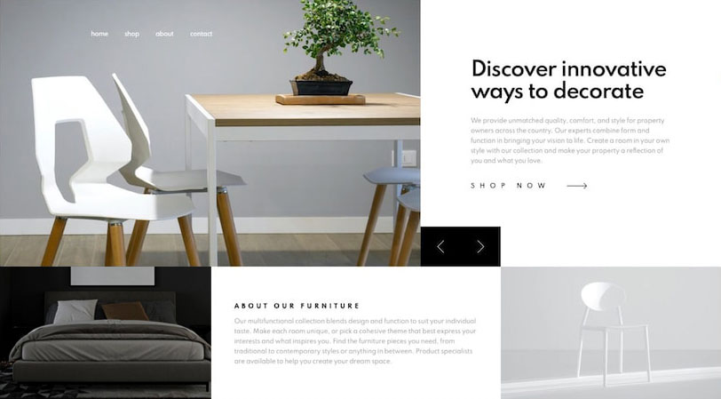

# Furniture homepage assignment
An individual assignment in which you will practice your coding skills.
You will build the homepage of an e-commerce website as shown here:

## Goals
* You build an HTML page according to the guidelines 
* You style a page with CSS for mobile and desktop
* You add interaction with Javascript
* Extra: SASS framework instead of plain css
* Extra: Create the shop pages for mobile (mobile_shop.png)

## Analysis phase: expected features 

* When a user resizes the width of the browser to 1024px or less, the layout changes to a mobile version.
* The upper-left image and the upper-right text automatically changes after five seconds
* or when a user uses the arrow-buttons to navigate through the images.
* The result should be pixel perfect according to the design.

## Design phase: technical design

* HTML/CSS: use css-grid and/or flex-box
* CSS: reset the default browser styles
* javascript: navigation buttons to change the upper-left image and upper-right text.
* javascript: use element.addEventListener('click', ...) instead of onClick-attribute in HTML.
* javascript: use an array for the images and text.
* javascript: use setInterval to change the images and text after a period of time.
* Frameworks like Bootstrap or others are **NOT ALLOWED!**
* Don't copy-paste, but write the code yourself to make sure the result will be as expected**

## Design phase: UI design
The designs are available in the `/design` folder. Besides a mobile version, also a version for a desktop.

All the images needed are stored in the `/images` folder. They are already optimised.

Don't forget to read `style-guide.md` with important information about colors, fonts etc.

## Preparation phase
* Study the designs and the style-guide.md
* Write down any questions and ask the client (your teacher).
* Create a backlog and save it: 'Projects' - 'Basic Kanban' - 'To do' in GitHub.
* Prioritize the backlog items.

## Development phase
* Start developing on the backlog items.
* Commit and push your changes regularly.

## Testing phase
* Test every backlog item.
* Test your code in different browsers and on different devices.
* Test the result for speed by using the LightHouse tool in the browser's Developer Tools.

## Feedback and reflection
In the last week you will present the results:
* during 5 minutes
* in English
* by showing your backlog and the tested result
* and by explaining how your javascript code works.
* You may expect questions about your code.

## Evaluation: preparation, realisation and testing
* Did you use flexbox and/or css grid principles?
* Is the backlog detailed enough (refinement) and prioritized?
* Is the code pushed regularly?
* Has the code been written by you?
* Is the code following the DRY (don't repeat yourself) principle?
* Is the code responsive?
* Is the code tested?
* Is the result according to the design?
